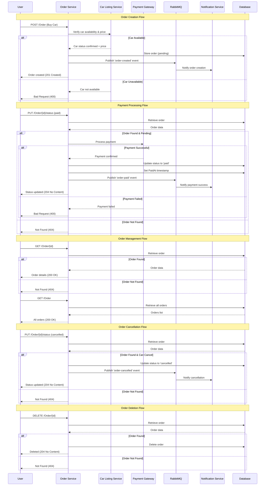

# Order Service

Service for managing purchase orders for cars. Currently uses in-memory storage.

## Tech Stack
- .NET 7 Web API
- RabbitMQ (planned for events)
- Swagger/OpenAPI
- Database: In-memory for now (PostgreSQL planned)

## Local URLs
- HTTP: `http://localhost:5068`
- HTTPS: `https://localhost:7291`
- Swagger UI: `/swagger`

## Features
- Create order when user clicks Buy
- Update order status: pending, paid, cancelled
- Track timestamps and amount
- Planned events: `order-created`, `order-paid`
- Will communicate with car-listing-service and notification-service

## Requirements
- .NET 7 SDK

## Configuration
- No database configuration yet (in-memory). Future: PostgreSQL via connection string.
- Environment: `ASPNETCORE_ENVIRONMENT=Development` (profiles set this).

## System Flow Overview

### Sequence Diagram



### Flow Description

1. **Order Creation**: User initiates car purchase → Service verifies car availability & price → Creates pending order (if available) → Publishes events → Notifies user
2. **Payment Processing**: User confirms payment → Service validates order → Processes payment → Updates order status → Publishes payment events → Notifies success
3. **Order Management**: Users can view individual orders or list all orders with proper error handling
4. **Order Cancellation**: Users can cancel orders → Service validates order → Updates status → Publishes cancellation events
5. **Order Deletion**: Users can delete orders → Service validates order → Removes from database

## Getting Started
```bash
dotnet restore
dotnet run
```

Open Swagger at `http://localhost:5068/swagger`.

## Data Model
`Order` DTO shape:

```json
{
  "id": "guid",
  "carId": "string",
  "buyerId": "string",
  "status": "pending | paid | cancelled",
  "createdAt": "2024-01-01T00:00:00Z",
  "paidAt": "2024-01-02T00:00:00Z or null",
  "amount": 19999.99
}
```

## API Endpoints
Base route: `/Order`

- `GET /Order` — Get all orders
- `GET /Order/{id}` — Get an order by id (Guid)
- `POST /Order` — Create a new order
- `PUT /Order/{id}/status` — Update order status (body is a JSON string)
- `DELETE /Order/{id}` — Delete an order by id

### Request/Response Examples

Create:
```bash
curl -X POST http://localhost:5068/Order \
  -H 'Content-Type: application/json' \
  -d '{
    "carId": "6567f1c2e9...",
    "buyerId": "user-123",
    "amount": 19999.99
  }'
```

Get by id:
```bash
curl http://localhost:5068/Order/<guid>
```

Update status (note: body is a JSON string):
```bash
curl -X PUT http://localhost:5068/Order/<guid>/status \
  -H 'Content-Type: application/json' \
  -d '"paid"'
```

Delete:
```bash
curl -X DELETE http://localhost:5068/Order/<guid>
```

## Swagger
Interactive docs at `http://localhost:5068/swagger`.

## Notes & Future Work
- Verify car status with car-listing-service before creating orders
- Publish `order-created` and `order-paid` events to RabbitMQ
- Persist orders in PostgreSQL
- Add authentication/authorization and request validation

## Troubleshooting
- 404s: confirm you are using `/Order` (capital O) and the correct Guid format
- Swagger not loading: ensure the app is running and you are using the HTTP port above